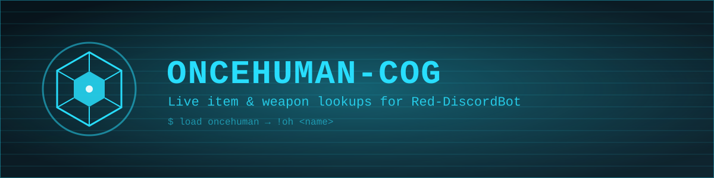

# oncehuman-cog



A [Red-DiscordBot](https://github.com/Cog-Creators/Red-DiscordBot) cog for [Once Human](https://www.oncehuman.game/) players: look up weapons, armor, deviations, mods, recipes, and more — pulled live from [Once Human DB](https://www.oncehumandb.com).

## Features

- **`!oh <name>`** — searches the Once Human Database and posts an embed for the best match: description, stats/properties, and a link to the full page
- Live lookups, not a bundled/stale dataset — every query hits oncehumandb.com directly, respecting their crawl policy (1 request/second, cached for an hour)
- Falls back gracefully with a direct link if the full entry page can't be parsed

## Installation

This cog is installed the normal Red way, via the core Downloader cog:

```
[p]repo add oncehuman-cog https://github.com/knkwebservices/oncehuman-cog
[p]cog install oncehuman-cog oncehuman
[p]load oncehuman
```

(Replace `[p]` with your bot's command prefix.)

## Commands

| Command | Description |
|---|---|
| `!oh <name>` | Look up a weapon, armor piece, deviation, mod, recipe, item, or more |
| `!oncehuman <name>` | Alias for `!oh` |

### Example

```
!oh Doombringer
```

## Credits

- Data courtesy of [Once Human DB](https://www.oncehumandb.com), part of the [GDBN](https://gdbn.live/) network
- Built by [K & K Web Services](https://knkws.com)

## License

MIT
